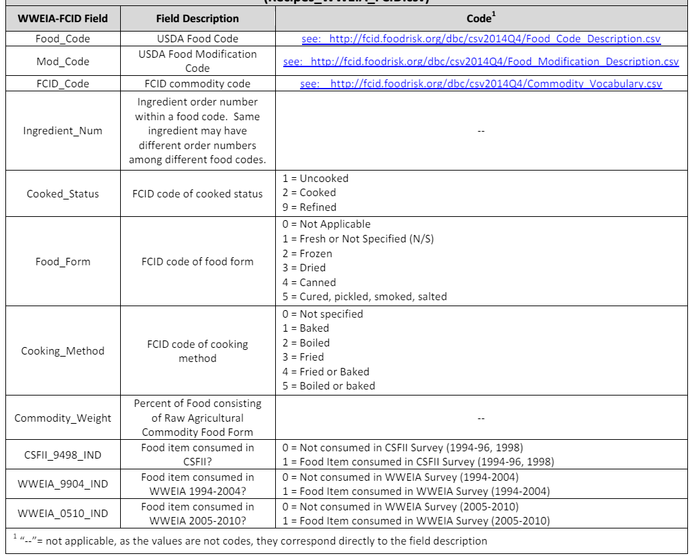

# U.S. EPA Food Commodity Intake Database (FCID)
## [https://fcid.foodrisk.org/](https://fcid.foodrisk.org/)

* [Codebook](https://fcid.foodrisk.org/docs/WWEIA-FCID_0510_Background-Codebooks-ControlStats.pdf): 2005-2010 What We Eat In America – Food Commodity Intake Database (WWEIA-FCID 0510)
* [Databases](https://fcid.foodrisk.org/dbc/)

## [Summary of Tables (Portuguese)](fcid-tables.pdf)

| Table | File | Description |
| ----- | ---- | ----------- |
| FCID Recipe Database | [Recipes_WWEIA_FCID_0510.csv](https://fcid.foodrisk.org/dbc/csv2014Q4/Recipes_WWEIA_FCID_0510.csv) | U.S. EPA recipe database to translate WWEIA food consumption to consumption of agricultural food commodities |
| WWEIA Food Code Descriptions | [Food_Code_Description.csv](https://fcid.foodrisk.org/dbc/csv2014Q4/Food_Code_Description.csv) | Text descriptions of WWEIA food codes |
| FCID Commodity Code Descriptions | [FCID_Code_Description.csv](https://fcid.foodrisk.org/dbc/csv2014Q4/FCID_Code_Description.csv) | Text descriptions of U.S. EPA FCID commodity codes |
| FCID Crop Group Descriptions | [FCID_Cropgroup_Description.csv](https://fcid.foodrisk.org/dbc/csv2014Q4/FCID_Cropgroup_Description.csv) | Text descriptions of U.S. EPA FCID crop groups |
| FCID Food Form Descriptions | [Food_Form_Description.csv](https://fcid.foodrisk.org/dbc/csv2014Q4/Food_Form_Description.csv) | Text descriptions of U.S. EPA food form codes |
| FCID Cooked Status Descriptions | [Cooked_Status_Description.csv](https://fcid.foodrisk.org/dbc/csv2014Q4/Cooked_Status_Description.csv) | Text descriptions of U.S. EPA cooking status codes |
| FCID Cooking Method Descriptions | [Cooking_Method_Description.csv](https://fcid.foodrisk.org/dbc/csv2014Q4/Cooking_Method_Description.csv) | Text descriptions of U.S. EPA cooking method codes |

# Directory Structure

~~~
├── README.md   <- this document
│
├── basics      <- food commodity basic description tables
│
├── recipes     <- recipes related tables
│
├── consumption <- food consumption statistics tables
│
└── computed    <- tables summarizing data of other tables
~~~

# Table Schemas

## Recipes (`recipes/Recipes_WWEIA_FCID_0510.csv`)

| Field | Name | Description |
| ----- | ---- | ----------- |
| Food_Code | code of the food (recipe) | Foreign key to the WWEIA Food Code Descriptions table. |
| Mod_Code  | modified code | Code of a modified version of the current food. Zero means unmodified. |
| Ingredient_Num | ingredient number | sequential number ordering the ingredients. |
| FCID_Code | code of the commodity (ingredient) | Foreign key to the FCID Commodity Code Descriptions table. |
| Cooked_Status | cooked status | Foreign key to the FCID Cooked Status Descriptions table. |
| Food_Form | food form. Foreign key to the FCID Food Form Descriptions table. |
| Cooking_Method | cooking method. Foreign key to the FCID Cooking Method Descriptions table. |
| Commodity_Weight | commodity (ingredient) weight | participation of this ingredient (commodity) in the recipe weight -- in percentual. |

## Food Commodity Profile (`computed/commodity-profile.csv`)

| Field | Description |
| ----- | ----------- |
| FCID_Code | code of the food commodity |
| FCID_Desc | description of the food commodity |
| CGN | group of food commodity |
| CG_Subgroup | subgroup of the food commodity |
| Popularity | number of people (among 62,160) who consumed the food |
| Intake_Sum | total consumption of food by 62,160 people in grams |
| Intake_AVG | average consumption of food in grams |
| Intake_BW_AVG | average consumption of food x person's weight |
| Recipes | number of recipes (among the 7,154) that used the product as an ingredient |
