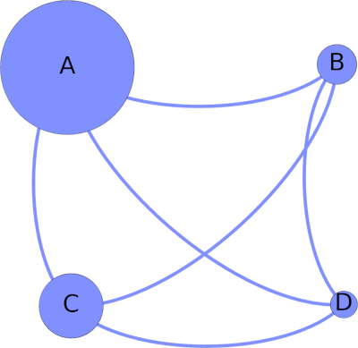
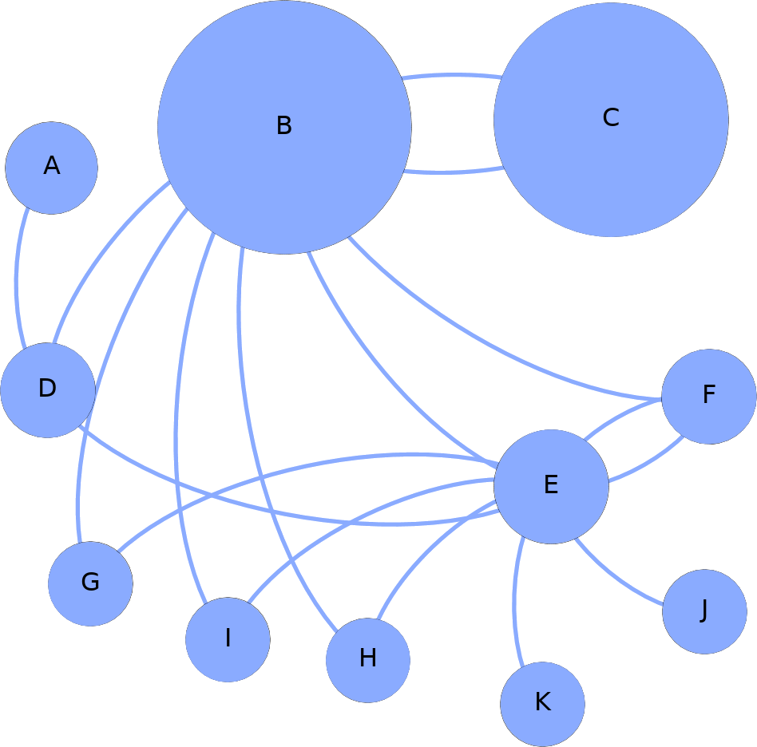
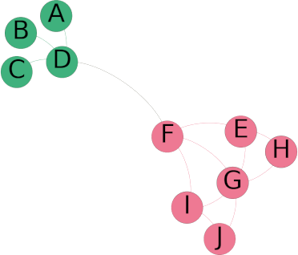
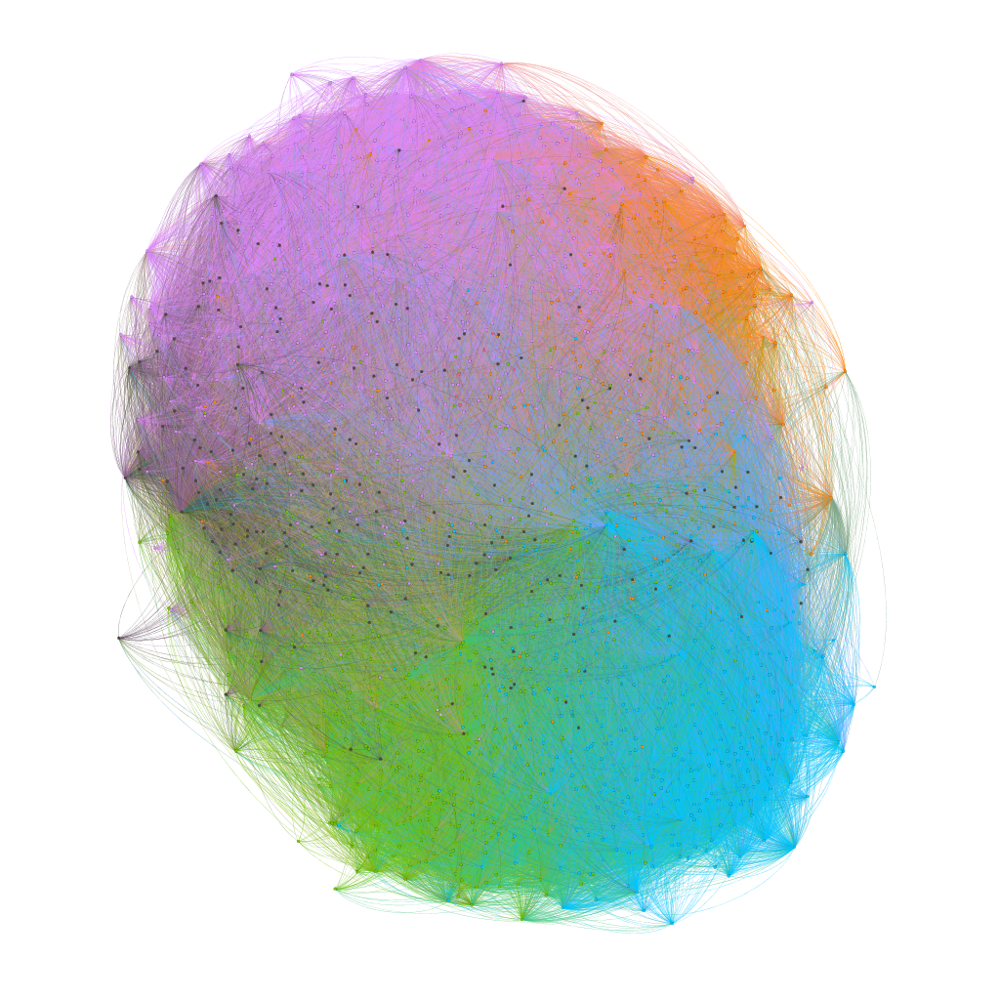
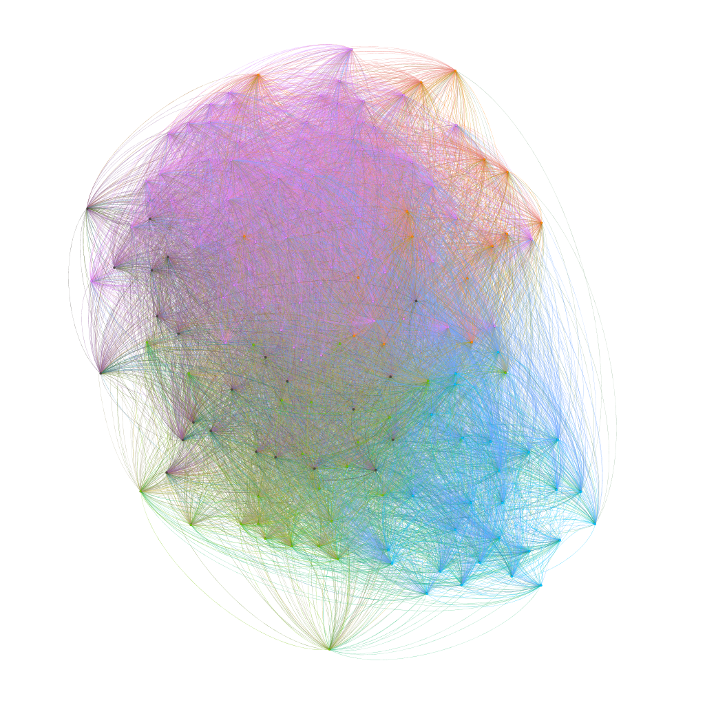

# lab2learn Network Science

Lab tutorial for experiments in Network Science.

# Gephi Lab

Download the latest version of [Gephi](https://gephi.org/).

The latest version used in this lab is: [Gephi for Linux 0.9.2](https://github.com/gephi/gephi/releases/download/v0.9.2/gephi-0.9.2-linux.tar.gz).

# Experiments

## PageRank

### Simple Example

The `pagerank` directory has examples of the centrality algorithm PageRank.

In the first example, you are invited to produce a Comma Separated Value (CSV) departing from the following graph:
.

The produced file is like the following: [pagerank-simple.cvs](pagerank/pagerank-simple.csv). It is the starting point.

The file is imported in the `Data Laboratory` tab, then the `[PageRank]` module in the `Statistics` tab computes the PageRank centrality. The centrality values are then related to the sizes of the nodes in the `[Appearance]` tab.

The resulting graph can be seen in the illustration below. The resulting Gephi file can be downloaded at: [pagerank-simple.gephi](pagerank/pagerank-simple.gephi).

### Wikipedia Example

Following the previous steps, you can depart from the file [pagerank-wikipedia.csv](pagerank/pagerank-wikipedia.csv) to create the example illustrated in Wikipedia: https://en.wikipedia.org/wiki/PageRank.

The result is illustrated in the figure below and the Gephi file can be downloaded at [pagerank-wikipedia.gephi](pagerank/pagerank-wikipedia.gephi).

## Community

The following example (inside the `community` directory) shows how Gephi can compute communities in a simples graph.

The graph is produced starting from the following CSV file: [community-simple.csv](community/community-simple.csv).

Using the `[Modularity]` module in the `Statistics` tab, the modules or communities are computed inside the graph. The communities are then related to the colors of the nodes in the `[Appearance]` tab.

The resulting graph can be seen in the illustration below. The resulting Gephi file can be downloaded at: [community-simple.gephi](community/community-simple.gephi).

## Symptoms–disease network

In the directory `symptoms-disease` congregates a CSV file from the following paper adapted for Gephi: [ncomms5212-s5_gephi.tsv](symptoms-disease/ncomms5212-s5_gephi.tsv).

> Zhou, X., Menche, J., Barabási, A.-L., & Sharma, A. (2014). Human symptoms–disease network. Nature Communications, 5(1), 4212. https://doi.org/10.1038/ncomms5212

Departing from this file that has diseases in the nodes and their relations (according to common symptoms) in the edges, communities are computed using the `[Modularity]` module in the `Statistics` tab. The communities are then related to the colors of the nodes in the `[Appearance]` tab.

A `Force Atlas` layout is applied to reorganize the nodes according to their communities. There are two files related to the experiment: [disease-disease-01.gephi](symptoms-disease/disease-disease-01.gephi) without labels and [disease-disease-02.gephi](symptoms-disease/disease-disease-02.gephi) with labels. In the directory it is possible to find PDF and SVG files of the results, presented in the figures below:

