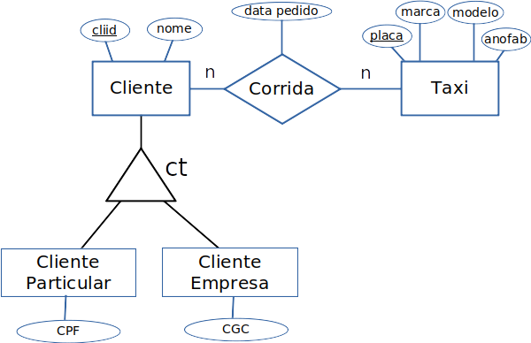

# Template para Entrega do Projeto Final

# Estrutura de Arquivos e Pastas

A seguir é apresentada a estrutura de pastas esperada para entrega de laboratórios:

~~~
├── README.md  <- apresentação da equipe
│
├── stage02    <- etapa 02 do trabalho
│
├── stage03    <- etapa 03 do trabalho
│
└── stage03    <- etapa 04 do trabalho
~~~

Na raiz deve haver um arquivo de nome `README.md` contendo a apresentação da equipe e do trabalho, como detalhado na seção seguinte.

## `stageXX`

Arquivos e diretórios referentes à entrega de um estapa específica. Cada diretório terá sua configuração detalhada abaixo.

# Modelo para Apresentação do Grupo e Trabalho

Este vídeo mostra como usar o Github e o Markdown para criar as suas submissões:

Este é um guia de como produzir documentação em Markdown. Para entender como criar documentos em Markdown no Github, veja o material/vídeo:
[Guia de Uso do Markdown](https://github.com/mc-unicamp/oficinas/tree/master/docs).

Vide detalhes sobre o Markdown em: [Mastering Markdown](https://guides.github.com/features/mastering-markdown/).

E mais especificamente sobre tabelas em: [Organizing information with tables](https://help.github.com/en/articles/organizing-information-with-tables)

Segue abaixo o modelo de como devem ser documentadas as entregas.
> Tudo o que aparecer neste modo de citação se refere algo que deve ser substituído pelo indicado. No modelo são colocados exemplos ilustrativos, que serão substituídos pelos da sua apresentação.

Para a construção dos diagramas, devem ser usados modelos disponíveis em: [Diagramas de Classes, Interfaces e Componentes](https://docs.google.com/presentation/d/1ML3WrnDtzh-4wqLmdXN9au1TBIwEqo7TIbMLNOYSMAI/edit?usp=sharing)
# Modelo para Apresentação do Grupo/Trabalho

# Projeto `<Título do Projeto>`

## Equipe `<nome da equipe>`
* `<nome completo>`
* `<nome completo>`
* `<nome completo>`

## Resumo do Projeto
> Texto resumindo o projeto.

# Modelo para Apresentação da Etapa 02 - Descrição da Proposta

Estrutura de pastas:

~~~
├── README.md  <- arquivo apresentando a proposta
│
├── images     <- arquivo de imagens para esta etapa (se houver)
│
└── slides     <- arquivo de slides em formato PDF
~~~

# Etapa 02 - Descrição da Proposta

## Slides da Proposta

> Coloque um link para o arquivo dos slides da proposta que estão na pasta `slides`.

## Motivação e Contexto

> Descrição do tema do projeto, incluindo motivação e contexto gerador.

## Método

> Quais são as análises a ser realizadas, quais os resultados esperados e qual o papel de cada modelo lógico no processo. Proposta de metodologia incluindo o que se pretende analisar e como será feita a análise.

## Bases de Dados
> Elencar as bases de dados candidatas a serem utilizadas no projeto.

título da base | link | breve descrição
----- | ----- | -----
`<título da base>` | `<link para a página da base>` | `<breve descrição da base>`

# Modelo para Apresentação da Etapa 03 - Análises com o Primeiro Modelo Lógico

Estrutura de pastas:

~~~
├── README.md  <- arquivo apresentando a proposta
│
├── data
│   ├── external       <- dados de terceiros em formato usado para entrada na transformação
│   ├── interim        <- dados intermediários, e.g., resultado de transformação
│   ├── processed      <- dados finais usados para a modelagem
│   └── raw            <- dados originais sem modificações
│
├── notebooks          <- Jupyter notebooks ou equivalentes
│
├── src                <- fonte em linguagem de programação ou sistema (e.g., Cytoscape)
│   └── README.md      <- instruções básicas de instalação/execução
│
└── assets             <- mídias usadas no projeto
~~~

# Etapa 03 - Análises com o Primeiro Modelo Lógico

## Primeiro Modelo Conceitual

> Coloque aqui a imagem do primeiro modelo conceitual em ER ou UML, como o exemplo a seguir:
> 

## Primeiros Modelos Lógicos

> Coloque aqui os primeiros modelos lógicos dos bancos de dados relacionados aos modelos conceituais. Para o modelo relacional, sugere-se o formato a seguir. Para outros modelos lógicos o formato é livre, pode ser adotado aqueles apresentados em sala.

> Exemplo de modelo lógico relacional
~~~
PESSOA(_Código_, Nome, Telefone)
ARMÁRIO(_Código_, Tamanho, Ocupante)
  Ocupante chave estrangeira -> PESSOA(Código)
~~~

## Primeiro programa de extração e conversão de dados

> Coloque um link para o arquivo do notebook que executa a extração e conversão de dados. Ele estará dentro da pasta `notebook`. Se por alguma razão o código não for executável no Jupyter, coloque na pasta `src`. Se a extração e conversão envolverem queries executadas atraves de uma interface de um SGBD não executável no Jupyter, como o Cypher, apresente na forma de markdown.

## Primeiro conjunto de queries

> Coloque um link para o arquivo do notebook que executa o conjunto de queries. Ele estará dentro da pasta `notebook`. Se por alguma razão o código não for executável no Jupyter, coloque na pasta `src`. Se as queries forem executadas atraves de uma interface de um SGBD não executável no Jupyter, como o Cypher, apresente na forma de markdown.

## Bases de Dados
> Elencar as bases de dados utilizadas no projeto. Trata-se de uma atualização daquelas apresentadas na Etapa 2.

título da base | link | breve descrição
----- | ----- | -----
`<título da base>` | `<link para a página da base>` | `<breve descrição da base>`

## Arquivos de Dados
> Elencar os arquivos usados no projeto que estão disponíveis no Github do projeto.

nome do arquivo | link | breve descrição
----- | ----- | -----
`<nome do arquivo>` | `<link para o arquivo>` | `<breve descrição do arquivo>`

> Os arquivos devem ser colocados na pasta `data`, em subpasta conforme seu papel (externo, interim, processado, raw). A diferença entre externo e raw é que o raw é em formato não adaptado para uso. A pasta `raw` é opcional, pois pode ser substituída pelo link para a base original da seção anterior.
> Coloque arquivos relacionais (usualmente CSV), XML ou JSON que não estejam disponíveis online e sejam acessados pelo notebook.

# Modelo para Apresentação da Etapa 04 - Análises com o Segundo Modelo Lógico

Estrutura de pastas:

~~~
├── README.md  <- arquivo apresentando a proposta
│
├── data
│   ├── external       <- dados de terceiros em formato usado para entrada na transformação
│   ├── interim        <- dados intermediários, e.g., resultado de transformação
│   ├── processed      <- dados finais usados para a modelagem
│   └── raw            <- dados originais sem modificações
│
├── notebooks          <- Jupyter notebooks ou equivalentes
│
├── slides             <- arquivo de slides em formato PDF
│
├── src                <- fonte em linguagem de programação ou sistema (e.g., Cytoscape)
│   └── README.md      <- instruções básicas de instalação/execução
│
└── assets             <- mídias usadas no projeto
~~~

# Etapa 04 - Análises com o Segundo Modelo Lógico

## Slides da Apresentação da Etapa

> Coloque um link para o arquivo dos slides da apresentação que estão na pasta `slides`.

## Modelo Conceitual Atualizado

> Coloque aqui a imagem do modelo conceitual atualizado em ER ou UML, como o exemplo a seguir:
> 

## Modelos Lógicos Atualizados

> Coloque aqui os dois modelos lógicos dos bancos de dados relacionados aos modelos conceituais. O modelo lógico da etapa anterior pode ser copiado ou apresentado revisado. Para o modelo relacional, sugere-se o formato a seguir. Para outros modelos lógicos o formato é livre, pode ser adotado aqueles apresentados em sala.

> Exemplo de modelo lógico relacional
~~~
PESSOA(_Código_, Nome, Telefone)
ARMÁRIO(_Código_, Tamanho, Ocupante)
  Ocupante chave estrangeira -> PESSOA(Código)
~~~

## Programa de extração e conversão de dados atualizado

> Coloque um link para o arquivo do notebook que executa a extração e conversão de dados. Ele estará dentro da pasta `notebook`. Se por alguma razão o código não for executável no Jupyter, coloque na pasta `src`. Se a extração e conversão envolverem queries executadas atraves de uma interface de um SGBD não executável no Jupyter, como o Cypher, apresente na forma de markdown.

## Conjunto de queries de dois modelos

> Acrescente um link para o arquivo do notebook que executa o segundo conjunto de queries. Ele estará dentro da pasta `notebook`. Se por alguma razão o código não for executável no Jupyter, coloque na pasta `src`. Se as queries forem executadas atraves de uma interface de um SGBD não executável no Jupyter, como o Cypher, apresente na forma de markdown.
> O link para queries da etapa 3 também deve aparecer aqui e as queries poderão ser revisadas.

## Bases de Dados
> Elencar as bases de dados utilizadas no projeto. Trata-se de uma atualização daquelas apresentadas na Etapa 3.

título da base | link | breve descrição
----- | ----- | -----
`<título da base>` | `<link para a página da base>` | `<breve descrição da base>`

## Arquivos de Dados
> Elencar os arquivos usados no projeto que estão disponíveis no Github do projeto (manter os da Etapa 3 e acrescentar os da Etapa 4).

nome do arquivo | link | breve descrição
----- | ----- | -----
`<nome do arquivo>` | `<link para o arquivo>` | `<breve descrição do arquivo>`

> Os arquivos devem ser colocados na pasta `data`, em subpasta conforme seu papel (externo, interim, processado, raw). A diferença entre externo e raw é que o raw é em formato não adaptado para uso. A pasta `raw` é opcional, pois pode ser substituída pelo link para a base original da seção anterior.
> Coloque arquivos relacionais (usualmente CSV), XML ou JSON que não estejam disponíveis online e sejam acessados pelo notebook.

# Modelo para Apresentação da Etapa Final

Estrutura de pastas:

~~~
├── README.md  <- arquivo apresentando a proposta
│
├── data
│   ├── external       <- dados de terceiros em formato usado para entrada na transformação
│   ├── interim        <- dados intermediários, e.g., resultado de transformação
│   ├── processed      <- dados finais usados para a modelagem
│   └── raw            <- dados originais sem modificações
│
├── notebooks          <- Jupyter notebooks ou equivalentes
│
├── slides             <- arquivo de slides em formato PDF
│
├── src                <- fonte em linguagem de programação ou sistema (e.g., Cytoscape)
│   └── README.md      <- instruções básicas de instalação/execução
│
└── assets             <- mídias usadas no projeto
~~~

# Etapa Final

## Projeto `<Título do Projeto>`

## Equipe `<nome da equipe>`
* `<nome completo>`
* `<nome completo>`
* `<nome completo>`

## Slides da Apresentação da Etapa Final

> Coloque um link para o arquivo dos slides da apresentação final que estão na pasta `slides`.

## Resumo do Projeto
> Texto resumindo o projeto.

## Motivação e Contexto

> Descrição do tema do projeto, incluindo motivação e contexto gerador.

## Detalhamento do Projeto
> Apresente aqui detalhes da análise. Nesta seção ou na seção de Resultados podem aparecer destaques de código como indicado a seguir. Note que foi usada uma técnica de highlight de código, que envolve colocar o nome da linguagem na abertura de um trecho com `~~~`, tal como `~~~python`.
> Os destaques de código devem ser trechos pequenos de poucas linhas, que estejam diretamente ligados a alguma explicação. Não utilize trechos extensos de código. Se algum código funcionar online (tal como um Jupyter Notebook), aqui pode haver links. No caso do Jupyter, preferencialmente para o Binder abrindo diretamente o notebook em questão.

~~~python
df = pd.read_excel("/content/drive/My Drive/Colab Notebooks/dataset.xlsx");
sns.set(color_codes=True);
sns.distplot(df.Hemoglobin);
plt.show();
~~~

## Evolução do Projeto
> Relatório de evolução, descrevendo as evoluções na modelagem do projeto, dificuldades enfrentadas, mudanças de rumo, melhorias e lições aprendidas. Referências aos diagramas, modelos e recortes de mudanças são bem-vindos.
> Podem ser apresentados destaques na evolução dos modelos conceitual e lógico. O modelo inicial e intermediários (quando relevantes) e explicação de refinamentos, mudanças ou evolução do projeto que fundamentaram as decisões.
> Relatar o processo para se alcançar os resultados é tão importante quanto os resultados.

## Resultados e Discussão
> Apresente os resultados da forma mais rica possível, com gráficos e tabelas. Mesmo que o seu código rode online em um notebook, copie para esta parte a figura estática. A referência a código e links para execução online pode ser feita aqui ou na seção de detalhamento do projeto (o que for mais pertinente).
> A discussão dos resultados também pode ser feita aqui na medida em que os resultados são apresentados ou em seção independente. Aspectos importantes a serem discutidos: É possível tirar conclusões dos resultados? Quais? Há indicações de direções para estudo? São necessários trabalhos mais profundos?

## Conclusões
> Apresente aqui as conclusões finais do trabalho e as lições aprendidas.

## Modelo Conceitual Final

> Coloque aqui a imagem do modelo conceitual final em ER ou UML, como o exemplo a seguir:
> 

## Modelos Lógicos Finais

> Coloque aqui os modelos lógicos dos bancos de dados relacionados aos modelos conceituais. Todos os modelos lógicos da versão final devem estar presentes, mesmo que tenham sido apresentados em etapas anteriores. Para o modelo relacional, sugere-se o formato a seguir. Para outros modelos lógicos o formato é livre, pode ser adotado aqueles apresentados em sala.

> Exemplo de modelo lógico relacional
~~~
PESSOA(_Código_, Nome, Telefone)
ARMÁRIO(_Código_, Tamanho, Ocupante)
  Ocupante chave estrangeira -> PESSOA(Código)
~~~

## Programa de extração e conversão de dados atualizado

> Coloque um link para o arquivo do notebook que executa a extração e conversão de dados. Ele estará dentro da pasta `notebook`. Se por alguma razão o código não for executável no Jupyter, coloque na pasta `src`. Se a extração e conversão envolverem queries executadas através de uma interface de um SGBD não executável no Jupyter, como o Cypher, apresente na forma de markdown.

## Conjunto de queries para todos os modelos

> Acrescente um link para o(s) arquivo(s) do(s) notebook(s) que executa(m) as queries para cada um dos modelos lógicos. Eles estarão dentro da pasta `notebook`. Se por alguma razão o código não for executável no Jupyter, coloque na pasta `src`. Se as queries forem executadas através de uma interface de um SGBD não executável no Jupyter, como o Cypher, apresente na forma de markdown.
> Apresente todas as suas queries em versão final, mesmo que tenham aparecido em etapas anteriores.

## Bases de Dados
> Elencar as bases de dados utilizadas no projeto. Apresente todas as bases usadas na versão final, mesmo aquelas que tenham sido apresentadas em etapas anteriores.

título da base | link | breve descrição
----- | ----- | -----
`<título da base>` | `<link para a página da base>` | `<breve descrição da base>`

## Arquivos de Dados
> Elencar os arquivos usados no projeto que estão disponíveis no Github do projeto. Apresente todos os arquivos usados na versão final, mesmo aqueles que tenham sido apresentadas em etapas anteriores.

nome do arquivo | link | breve descrição
----- | ----- | -----
`<nome do arquivo>` | `<link para o arquivo>` | `<breve descrição do arquivo>`

> Os arquivos devem ser colocados na pasta `data`, em subpasta conforme seu papel (externo, interim, processado, raw). A diferença entre externo e raw é que o raw é em formato não adaptado para uso. A pasta `raw` é opcional, pois pode ser substituída pelo link para a base original da seção anterior.
> Coloque arquivos relacionais (usualmente CSV), XML ou JSON que não estejam disponíveis online e sejam acessados pelo notebook.