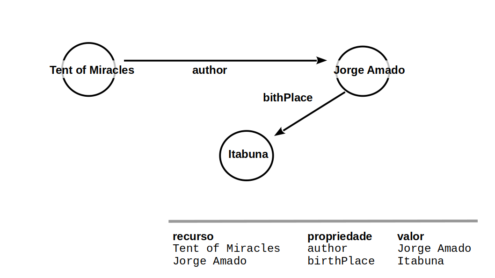

# Modelo de Apresentação da Entrega Prévia

# Estrutura de Arquivos e Pastas

A estrutura aqui apresentada é uma simplificação daquela proposta pelo [Cookiecutter Data Science](https://drivendata.github.io/cookiecutter-data-science/). Também será aceito que o projeto adote a estrutura completa do Cookiecutter Data Science e isso será considerado um diferencial. A estrutura geral é a seguinte e será detalhada a seguir:

~~~
├── README.md  <- arquivo apresentando a proposta
│
├── data
│   ├── external       <- dados de terceiros em formato usado para entrada na transformação
│   ├── interim        <- dados intermediários, e.g., resultado de transformação
│   ├── processed      <- dados finais usados para a publicação
│   └── raw            <- dados originais sem modificações
│
├── notebooks          <- Jupyter notebooks ou equivalentes
│
├── slides             <- arquivo de slides em formato PDF
│
├── src                <- fonte em linguagem de programação ou sistema (e.g., Cytoscape)
│   └── README.md      <- instruções básicas de instalação/execução
│
└── assets             <- mídias usadas no projeto
~~~

Na raiz deve haver um arquivo de nome `README.md` contendo a apresentação do projeto, como detalhado na seção seguinte.

## `data`

Arquivos de dados usados no projeto, quando isso ocorrer.

## `notebooks`

Testes ou prototipos relacionados ao projeto que tenham sido executados no Jupyter.

## `src`

Projeto na linguagem escolhida, incluindo todos os arquivos de dados e bibliotecas necessários para a sua execução. Dentro dessa pasta sugerimos que você mantenha uma estrutura equivalente ao Eclipse, com uma subpasta `src` onde estarão os fontes e outra subpasta `bin` onde estarão os binários.

 Acrescente na raiz um arquivo `README.md` com as instruções básicas de instalação e execução.

## `assets`

Qualquer mídia usada no seu projeto: vídeo, imagens, animações, slides etc. Coloque os arquivos aqui (mesmo que você mantenha uma cópia no diretório do código).

# Modelo para Apresentação da Entrega Prévia do Projeto

# Projeto `<Título do Projeto>`

# Equipe `<nome da equipe>` - `<sigla da equipe>`
* `<nome completo>` - `<RA>`
* `<nome completo>` - `<RA>`
* `<nome completo>` - `<RA>`

## Resumo do Projeto
> Texto resumindo o projeto.

## Slides da Apresentação
> Coloque aqui o link para o PDF da apresentação prévia

## Modelo Conceitual Preliminar

> Coloque aqui a imagem do modelo conceitual preliminar em ER ou UML, como o exemplo a seguir:
> 

## Modelos Lógicos Preliminares

> Coloque aqui os primeiros modelos lógicos dos bancos de dados relacionados aos modelos conceituais. Para o modelo relacional, sugere-se o formato a seguir. Para outros modelos lógicos o formato é livre, pode ser adotado aqueles apresentados em sala.

> Exemplo de modelo lógico relacional
~~~
PESSOA(_Código_, Nome, Telefone)
ARMÁRIO(_Código_, Tamanho, Ocupante)
  Ocupante chave estrangeira -> PESSOA(Código)
~~~

> Para o modelo de grafos de propriedades, utilize este
> [modelo de base](https://docs.google.com/presentation/d/10RN7bDKUka_Ro2_41WyEE76Wxm4AioiJOrsh6BRY3Kk/edit?usp=sharing) para construir o seu.
> Coloque a imagem do PNG do seu modelo lógico como ilustrado abaixo (a imagem estará na pasta `image`):
>
> 

> Para o modelo de grafos de conhecimento, utilize a abordagem
> (recurso, propriedade, valor) para apresentar seu grafo exemplo.
> Coloque a imagem do PNG do seu modelo lógico como ilustrado abaixo (a imagem estará na pasta `image).
>
> Você pode usar um grafo ilustrando as classes, como este:
> 
>
> Além de outro com exemplo de instâncias, como este:
> 

> Para modelos hierárquicos (XML e JSON), utilize um formato
> conforme o abaixo:

> 

## Dataset Preliminar a ser Publicado
> Elencar os arquivos/bases preliminares dos datasets serão publicados publicados.

título do arquivo/base | link | breve descrição
----- | ----- | -----
`<título do arquivo/base>` | `<link para arquivo/base>` | `<breve descrição do arquivo/base>`

> Os arquivos finais do dataset publicado devem ser colocados na pasta `data`, em subpasta `processed`. Outros arquivos serão colocados em subpastas conforme seu papel (externo, interim, raw). A diferença entre externo e raw é que o raw é em formato não adaptado para uso. A pasta `raw` é opcional, pois pode ser substituída pelo link para a base original da seção anterior.
> Coloque arquivos que não estejam disponíveis online e sejam acessados pelo notebook. Relacionais (usualmente CSV), XML, JSON e CSV ou triplas para grafos.

## Bases de Dados
> Elencar as bases de dados fonte utilizadas no projeto.

título da base | link | breve descrição
----- | ----- | -----
`<título da base>` | `<link para a página da base>` | `<breve descrição da base>`

## Operações realizadas para a construção do dataset

> Coloque um link para o arquivo do notebook, programas ou workflows que executam as operações de construção do dataset:
* extração de dados de fontes não estruturadas como, por exemplo, páginas Web
* agregação de dados fragmentados obtidos a partir de API
* integração de dados de múltiplas fontes
* tratamento de dados
* transformação de dados para facilitar análise e pesquisa

> Se for notebook, ele estará dentro da pasta `notebook`. Se por alguma razão o código não for executável no Jupyter, coloque na pasta `src`. Se as operações envolverem queries executadas atraves de uma interface de um SGBD não executável no Jupyter, como o Cypher, apresente na forma de markdown.

## Perguntas de Pesquisa/Análise Combinadas e Respectivas Análises

> Liste aqui as perguntas de pesquisa/análise e respectivas análises.
> Nem todas as perguntas precisam de queries que as implementam.
> É possível haver perguntas em que a solução é apenas descrita para
> demonstrar o potencial da base.
>
### Pergunta/Análise 1
> * Pergunta 1
>   
>   * Explicação sucinta da análise que será feita ou conjunto de queries que
>     responde à pergunta.

### Pergunta/Análise 2
> * Pergunta 2
>   
>   * Explicação sucinta da análise que será feita ou conjunto de queries que
>     responde à pergunta.

### Pergunta/Análise 3
> * Pergunta 3
>   
>   * Explicação sucinta da análise que será feita ou conjunto de queries que
>     responde à pergunta.

> Coloque um link para o arquivo do notebook que executa o conjunto de queries. Ele estará dentro da pasta `notebook`. Se por alguma razão o código não for executável no Jupyter, coloque na pasta `src`. Se as queries forem executadas atraves de uma interface de um SGBD não executável no Jupyter, como o Cypher, apresente na forma de markdown.
