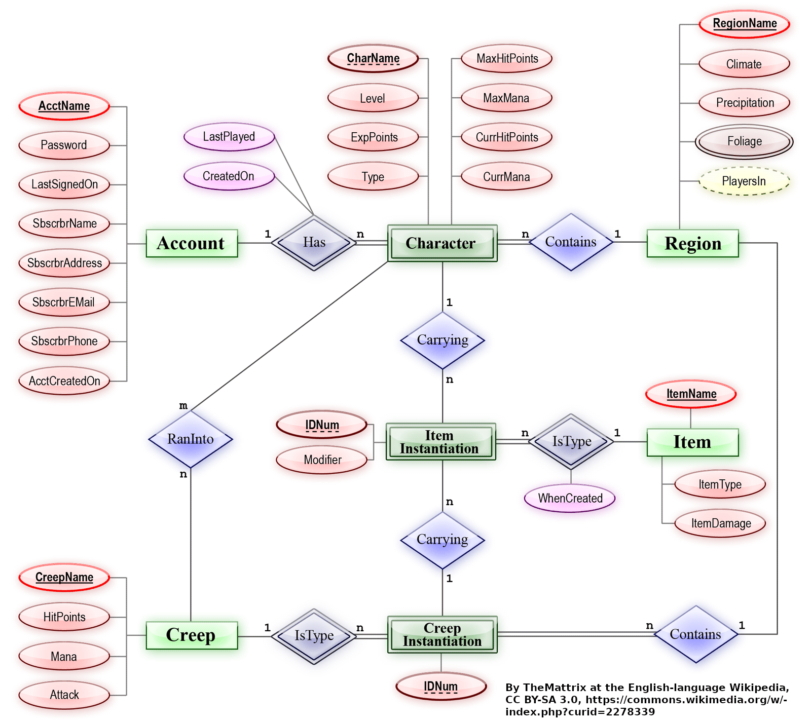
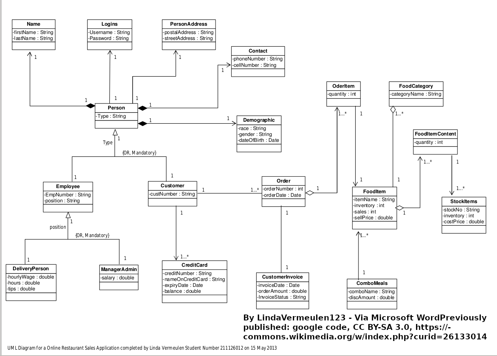

# Modelo para Apresentação do Lab02 - Modelagem Conceitual de Refeições em um Restaurante

Estrutura de pastas:

~~~
├── README.md  <- arquivo apresentando a tarefa
│
└──images     <- arquivos de imagens usadas no documento
~~~

# Equipe `<nome da equipe>`

# Subgrupo `<letra do subgrupo>`
* `<nome completo>` - `<RA>`
* `<nome completo>` - `<RA>`
* `<nome completo>` - `<RA>`

## Modelo Conceitual ER

> Coloque aqui o diagrama entidade-relacionamento produzido pela sua equipe. O diagrama deve atributos, cardinalidade e entidades fracas. Será valorizado o uso de herança.
>
> Para imagens grandes, utilize a técnica abaixo, em que a imagem é compartilhada em tamanho grande e redimensionada usando atributos width e height. O que permite ver a imagem em tamanho grande.

# Modelo Conceitual UML

> Coloque aqui o diagrama UML produzido pela sua equipe. O diagrama deve detalhar atributos e cardinalidade. Será valorizado o uso de herança, agregação e composição, quando pertinente.

