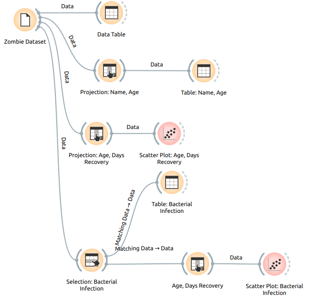
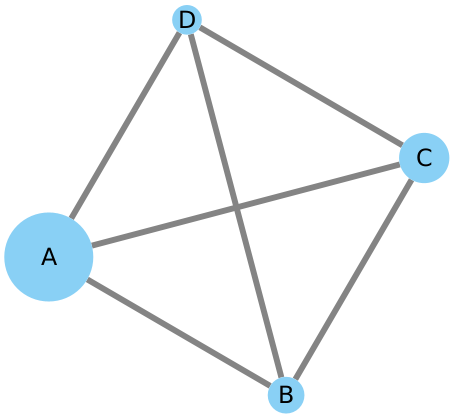
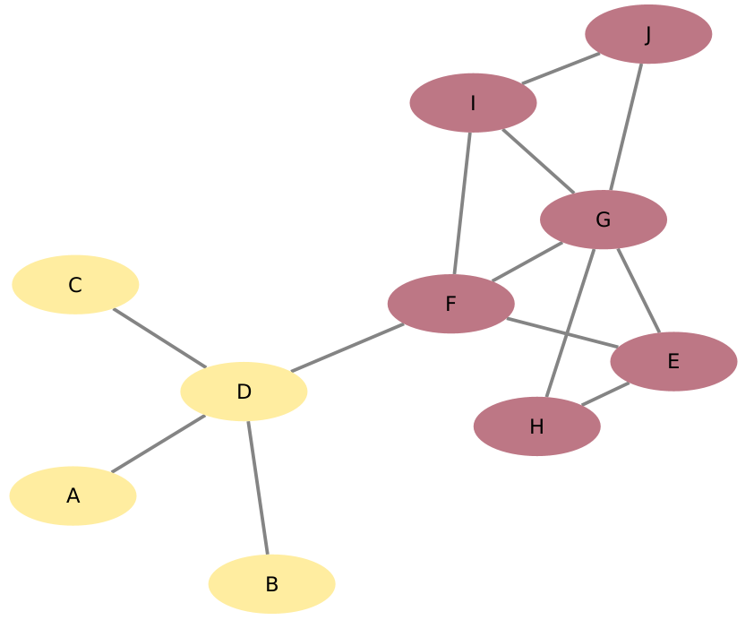

# Template para Entrega dos Laboratórios Individuais

# Estrutura de Arquivos e Pastas

A seguir é apresentada a estrutura de pastas esperada para entrega de laboratórios:

~~~
├── README.md  <- apresentação do aluno
│
├── lab01      <- primeiro lab
│
├── lab02      <- segundo lab
│
├── lab03     <- terceiro lab
│
├── lab04     <- quarto lab
│
├── lab05     <- quinto lab
│
└── lab06    <- sexto lab
~~~

Na raiz deve haver um arquivo de nome `README.md` contendo a apresentação do aluno, como detalhado na seção seguinte.

## `labXX`

Arquivos e diretórios referentes à entrega de um laboratório específico. Cada diretório terá sua configuração detalhada abaixo.

# Modelo para Apresentação do Aluno e Laboratórios

Este vídeo mostra como usar o Github e o Markdown para criar as suas submissões:

Este é um guia de como produzir documentação em Markdown. Para entender como criar documentos em Markdown no Github, veja o material/vídeo:
[Guia de Uso do Markdown](https://github.com/mc-unicamp/oficinas/tree/master/docs).

Vide detalhes sobre o Markdown em: [Mastering Markdown](https://guides.github.com/features/mastering-markdown/).

E mais especificamente sobre tabelas em: [Organizing information with tables](https://help.github.com/en/articles/organizing-information-with-tables)

Segue abaixo o modelo de como devem ser documentadas as entregas.
> Tudo o que aparecer neste modo de citação se refere algo que deve ser substituído pelo indicado. No modelo são colocados exemplos ilustrativos, que serão substituídos pelos da sua apresentação.

Para a construção dos diagramas, devem ser usados modelos disponíveis em: [Diagramas de Classes, Interfaces e Componentes](https://docs.google.com/presentation/d/1ML3WrnDtzh-4wqLmdXN9au1TBIwEqo7TIbMLNOYSMAI/edit?usp=sharing)
# Modelo para Apresentação do Aluno

# Aluno
* `<nome completo>`

# Modelo para Apresentação do Lab01 - API Acesso

Estrutura de pastas:

~~~
├── README.md  <- arquivo apresentando a tarefa
│
├── images     <- arquivo de imagem da tarefa
│
└── notebook   <- arquivos do notebook
~~~

## Tarefa 1 sobre APIs de acesso

> Coloque um link para o arquivo do notebook com a resolução da primeira tarefa (dois acessos). Ele estará dentro da pasta `notebook`.

## Tarefa 2 sobre Engenharia Reversa
> Coloque a imagem do PNG do seu diagrama como ilustrado abaixo (a imagem estará na pasta `image`):
> 
> 

# Modelo para Apresentação do Lab02 - Modelos Lógicos

Estrutura de pastas:

~~~
├── README.md  <- arquivo apresentando a tarefa
│
└── notebook   <- arquivos do notebook
~~~

## Tarefa sobre Acesso a DBPedia e MeSH

> Coloque um link para o arquivo do notebook com a resolução da tarefa. Ele estará dentro da pasta `notebook`.

# Modelo para Apresentação do Lab03 - Modelo Lógico de Tabelas com Orange/Kaggle

Estrutura de pastas:

~~~
├── README.md  <- arquivo apresentando a tarefa
│
├── images     <- imagem da captura de tela do lab
│
└── orange     <- arquivo do Orange
~~~

## Tarefa sobre Análise de Dados usando o Orange

> Coloque a imagem do PNG da captura de tela do seu projeto Orange conforme ilustrado abaixo (a imagem estará na pasta `image`):
> 
> 

> Coloque um link para o arquivo do Orange com a resolução da tarefa. Ele estará dentro da pasta `orange`.

# Modelo para Apresentação do Lab04 - NHANES/SQL

Estrutura de pastas:

~~~
├── README.md  <- arquivo apresentando a tarefa
│
└── notebook   <- arquivos do notebook
~~~

## Tarefa de sentenças SQL para dados do Nutrition Examination Survey 

> Coloque um link para o arquivo do notebook com a resolução da tarefa. Ele estará dentro da pasta `notebook`.

# Modelo para Apresentação do Lab05 - SQL e Regras de Associação

Estrutura de pastas:

~~~
├── README.md  <- arquivo apresentando a tarefa
│
└── notebook   <- arquivos do notebook
~~~

## Tarefa de sentenças SQL / Regras de Associação para o FDA Adverse Event Reporting System (FAERS)

> Coloque um link para o arquivo do notebook com a resolução da tarefa. Ele estará dentro da pasta `notebook`.

# Modelo para Apresentação do Lab06 - Cypher e FAERS

Estrutura de pastas:

~~~
├── README.md  <- arquivo apresentando a tarefa
~~~

## Tarefa de Cypher e o FDA Adverse Event Reporting System (FAERS)

## Exercício 1

Escreva uma sentença em Cypher que crie o medicamento de nome `Metamizole`, código no DrugBank `DB04817`.

### Resolução
~~~cypher
(escreva aqui a resolução em Cypher)
~~~

## Exercício 2

Considerando que a `Dipyrone` e `Metamizole` são o mesmo medicamento com nomes diferentes, crie uma aresta com o rótulo `:SameAs` que ligue os dois.

### Resolução
~~~cypher
(escreva aqui a resolução em Cypher)
~~~

## Exercício 3

Use o `DELETE` para excluir o relacionamento que você criou (apenas ele).

### Resolução
~~~cypher
(escreva aqui a resolução em Cypher)
~~~

## Exercício 4

Faça a projeção em relação a Patologia, ou seja, conecte patologias que são tratadas pela mesma droga.

### Resolução
~~~cypher
(escreva aqui a resolução em Cypher)
~~~

## Exercício 5

Construa um grafo ligando os medicamentos aos efeitos colaterais (com pesos associados) a partir dos registros das pessoas, ou seja, se uma pessoa usa um medicamento e ela teve um efeito colateral, o medicamento deve ser ligado ao efeito colateral.

### Resolução
~~~cypher
(escreva aqui a resolução em Cypher)
~~~

## Exercício 6

Que tipo de análise interessante pode ser feita com esse grafo?

Proponha um tipo de análise e escreva uma sentença em Cypher que realize a análise.

### Resolução
~~~cypher
(escreva aqui a resolução em Cypher)
~~~

# Modelo para Apresentação do Lab07 - Análise de Redes

Estrutura de pastas:

~~~
├── README.md  <- arquivo apresentando a tarefa
│
└── notebook   <- arquivos do notebook
~~~

## Tarefa de análises feitas no Cypher

## Exercício 1

Calcule o Pagerank do exemplo da Wikipedia em Cypher:

~~~cypher
(escreva aqui a resolução em Cypher)
~~~

> Coloque aqui a imagem resultante conforme o exemplo (não obrigatório, mas sugerido - imagem produzida pelo CytoScape ou Gephi).

~~~cypher
(escreva aqui a resolução em Cypher)
~~~

## Exercício 2

Departing from a Drug-Drug graph created in a previous lab, whose relationship determines drugs taken together, apply a community detection in it to see the results:

~~~cypher
(escreva aqui a resolução em Cypher)
~~~

> Coloque aqui a imagem resultante conforme o exemplo (não obrigatório, mas sugerido - imagem produzida pelo CytoScape ou Gephi).

