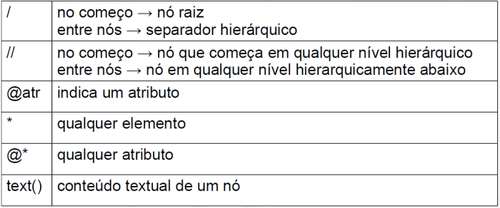
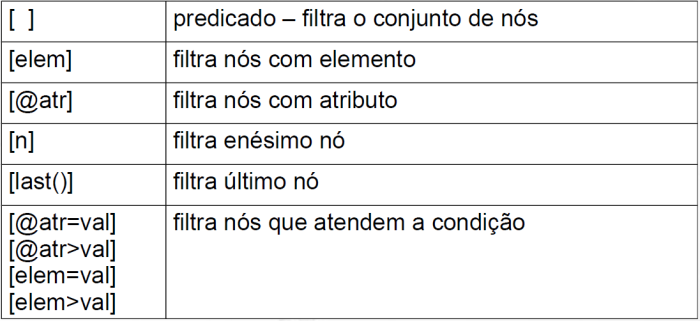
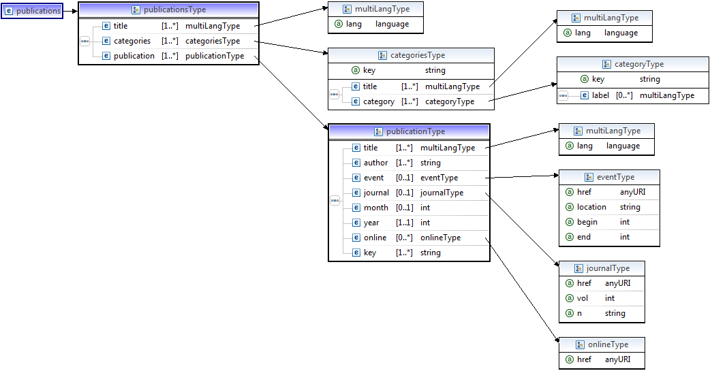

# XPath e XQuery

## XPath

Para executar sentenças XPath entre no Online Toolz: http://www.online-toolz.com/tools/xpath-editor.php
Cole na caixa XML o arquivo abaixo que será usado para todos os experimentos de XPath a seguir:

~~~xml
<fichario>
  <individuo nome="Asdrubal da Silva">
    <idade>15</idade> 
    <genero>masculino</genero> 
  </individuo>
  <individuo nome="Quincas Borba">
    <idade>33</idade> 
    <genero>masculino</genero> 
  </individuo>
  <individuo nome="Doriana Margarina">
    <idade>42</idade> 
    <genero>feminino</genero> 
  </individuo>
</fichario>
~~~
Execute cada uma das sentenças abaixo na caixa XPATH Query.

## XPath 1
~~~xquery
/fichario/individuo
~~~

## XPath 2
~~~xquery
//individuo
~~~

## XPath 3
~~~xquery
//individuo/@nome
~~~

## XPath 4
~~~xquery
/fichario/*/idade
~~~

## XPath 5
~~~xquery
/fichario/*/idade/text()
~~~

## Predicados

## XPath 6
~~~xquery
//individuo[2]
~~~

## XPath 7
~~~xquery
//individuo[@nome="Quincas Borba"]
~~~

## XPath 8
~~~xquery
//individuo[@nome="Quincas Borba"]/idade
~~~

## XPath 9
~~~xquery
//individuo[@nome="Quincas Borba"]/idade/text()
~~~

## XPath 10
~~~xquery
//individuo[idade>20]/@nome
~~~

# XPath
## Questão 1
Construa uma comando SELECT que retorne dados equivalentes a este XPath
~~~xquery
//individuo[idade>20]/@nome
~~~

### Resolução
~~~xquery
(escreva aqui a resolução em XPath)
~~~

# XQuery
~~~xquery
FOR <variable bindings to individual nodes (elements)>
  LET <variable bindings to collections of nodes (elements)>
  WHERE <qualifier conditions>
  RETURN <query result specification>
~~~

Execute cada uma das sentenças abaixo na caixa XQuery.

Você deve testar as queries em: http://try.zorba.io/

## XQuery 1
~~~xquery
xquery version "1.0";
let $message := 'Dinotopia'
return
<livro>Título: {$message}</livro>
~~~

## XML no Resultado
* {} → para indicar valores de retorno dentro do XML 
* data() → extrai o conteúdo literal do elemento ou atributo

## XQuery 2
~~~xquery
xquery version "1.0";
let $message := 'Dinotopia'
return data($message)
~~~

## XQuery 3
~~~xquery
xquery version "1.0";
let $message := 'Dinotopia'
return
<livro>Título: {$message}</livro>
~~~

## XQuery 4
~~~xquery
xquery version "1.0";
let $message := 'Dinotopia'
return
<livro>{data('Título:'), $message}</livro>
~~~

## XQuery 5
~~~xquery
xquery version "1.0";
let $message := 'Dinotopia'
return
<livro>{concat('Título: ', $message)}</livro>
~~~

## Acessando um arquivo XML
As próximas queries serão no arquivo: https://raw.githubusercontent.com/santanche/lab2learn/master/xml/fichario.xml
~~~xml
<fichario>
  <individuo nome="Asdrubal da Silva">
    <idade>15</idade> 
    <genero>masculino</genero> 
  </individuo>
  <individuo nome="Quincas Borba">
    <idade>33</idade> 
    <genero>masculino</genero> 
  </individuo>
  <individuo nome="Doriana Margarina">
    <idade>42</idade> 
    <genero>feminino</genero> 
  </individuo>
</fichario>
~~~

## XQuery 6
~~~xquery
let $fichariodoc := doc('https://raw.githubusercontent.com/santanche/lab2learn/master/xml/fichario.xml')

return $fichariodoc/fichario
~~~

## XQuery 7
~~~xquery
let $fichariodoc := doc('https://raw.githubusercontent.com/santanche/lab2learn/master/xml/fichario.xml')

return $fichariodoc/fichario/individuo/idade
~~~

## XQuery 8
~~~xquery
let $fichariodoc := doc('https://raw.githubusercontent.com/santanche/lab2learn/master/xml/fichario.xml')

return $fichariodoc//individuo[idade>20][genero="masculino"]
~~~

## XQuery 9
~~~xquery
let $fichariodoc := doc('https://raw.githubusercontent.com/santanche/lab2learn/master/xml/fichario.xml')

return count($fichariodoc//individuo)
~~~

## XQuery 10
~~~xquery
let $fichariodoc := doc('https://raw.githubusercontent.com/santanche/lab2learn/master/xml/fichario.xml')

return count($fichariodoc//individuo[idade>20][genero="masculino"])
~~~

## XQuery 11
~~~xquery
let $fichariodoc := doc('https://raw.githubusercontent.com/santanche/lab2learn/master/xml/fichario.xml')

for $i in ($fichariodoc//individuo)
return $i/idade
~~~

## XQuery 12
~~~xquery
let $fichariodoc := doc('https://raw.githubusercontent.com/santanche/lab2learn/master/xml/fichario.xml')

for $i in ($fichariodoc//individuo)
where $i[idade>17]
return $i
~~~

## Questão 2
Qual a outra maneira de escrever esta query sem o where?

~~~xquery
let $fichariodoc := doc('https://raw.githubusercontent.com/santanche/lab2learn/master/xml/fichario.xml')
 
for $i in ($fichariodoc//individuo)
where $i[idade>17]
return {data($i/@nome)}
~~~

### Resolução
~~~xquery
(escreva aqui a resolução em XQuery)
~~~

## Questão 3
Escreva uma consulta SQL equivalente ao XQuery:
~~~xquery
let $fichariodoc := doc('https://raw.githubusercontent.com/santanche/lab2learn/master/xml/fichario.xml')

for $i in ($fichariodoc//individuo)
where $i[idade>17]
return {data($i/@nome)}
~~~

### Resolução
~~~sql
(escreva aqui a resolução em SQL)
~~~

# XML no resultado

## XQuery 13
~~~xquery
let $fichariodoc := doc('https://raw.githubusercontent.com/santanche/lab2learn/master/xml/fichario.xml')

for $i in ($fichariodoc//individuo)
where $i[idade>17]
return <maior>{data($i/@nome)}</maior>
~~~

## XQuery dentro de outro XQuery

## XQuery 14
~~~xquery
let $fichariodoc := doc('https://raw.githubusercontent.com/santanche/lab2learn/master/xml/fichario.xml')
return
<classificacao>
{
  for $i in ($fichariodoc//individuo)
  where $i[idade>17]
  return <maior>{data($i/@nome)}</maior>
}
</classificacao>
~~~

## Order by

## XQuery 15
~~~xquery
let $fichariodoc := doc('https://raw.githubusercontent.com/santanche/lab2learn/master/xml/fichario.xml')

for $i in ($fichariodoc//individuo)
where $i[idade>17]
order by $i/@nome
return <maior>{data($i/@nome)}</maior>
~~~

## If

## XQuery 16
~~~xquery
let $fichariodoc := doc('https://raw.githubusercontent.com/santanche/lab2learn/master/xml/fichario.xml')

for $i in ($fichariodoc//individuo)
return if ($i[idade>=18])
  then <maior>{data($i/@nome)}</maior>
  else <menor>{data($i/@nome)}</menor>
~~~

# Recursos avançados

Com o arquivo: https://raw.githubusercontent.com/santanche/lab2learn/master/xml/autor-livro-referencia.xml

## Join

## XQuery
~~~xquery
let $autorlivro := doc('https://raw.githubusercontent.com/santanche/lab2learn/master/xml/autor-livro-referencia.xml')
for $a in ($autorlivro/catalogo/autores/autor),
    $l in ($autorlivro/catalogo/livros/livro)
where $a/@livroid = $l/@id
return {concat('Autor: ', data($a/@nome), ', Livro: ', data($l/@titulo))}
~~~

## Group by

## XQuery 17 - número de livros por ano

A sequência `'&#xa;'` é usada para pular linha:

~~~xquery
let $autorlivro := doc('https://raw.githubusercontent.com/santanche/lab2learn/master/xml/autor-livro-referencia.xml')
for $l in ($autorlivro/catalogo/livros/livro)
let $ano := $l/@ano
group by $ano
return {'Livros -- ano: ', $ano, 'quantidade: ', count($l), '&#xa;'}
~~~

# Questões XQuery avançado

Responda as seguintes questões fazendo acesso ao arquivo XML disponível em: https://raw.githubusercontent.com/santanche/lab2learn/master/data/publications/publications.xml

Cujo esquema está disponível em: https://raw.githubusercontent.com/santanche/lab2learn/master/data/publications/publications.xsd

A seguir são apresentados diagramas do esquema do arquivo:

## Questão 4
Retorne quantas publicações são posteriores ao ano de 2011.

### Resolução
~~~xquery
(escreva aqui a resolução em XQuery)
~~~

## Questão 5
Retorne a categoria cujo `<label>` em inglês seja 'e-Science Domain'.

### Resolução
~~~xquery
(escreva aqui a resolução em XQuery)
~~~

## Questão 6
Retorne as publicações associadas à categoria cujo `<label>` em inglês seja 'e-Science Domain'. A associação entre o label e a key da categoria deve ser feita na consulta.

### Resolução
~~~xquery
(escreva aqui a resolução em XQuery)
~~~
